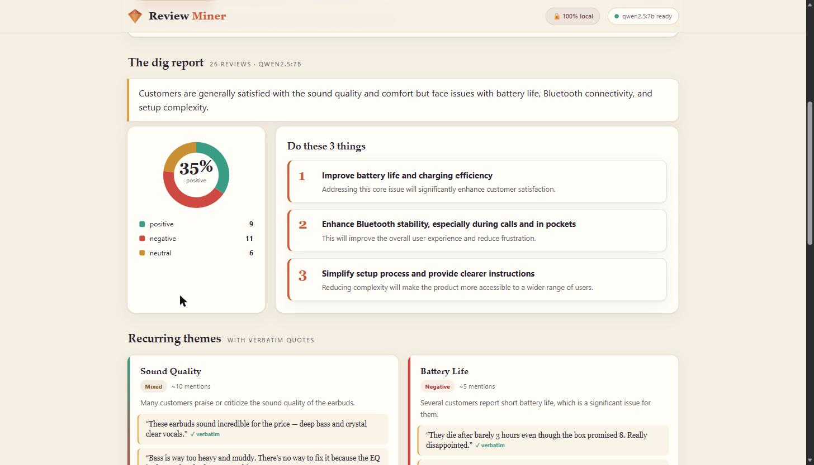
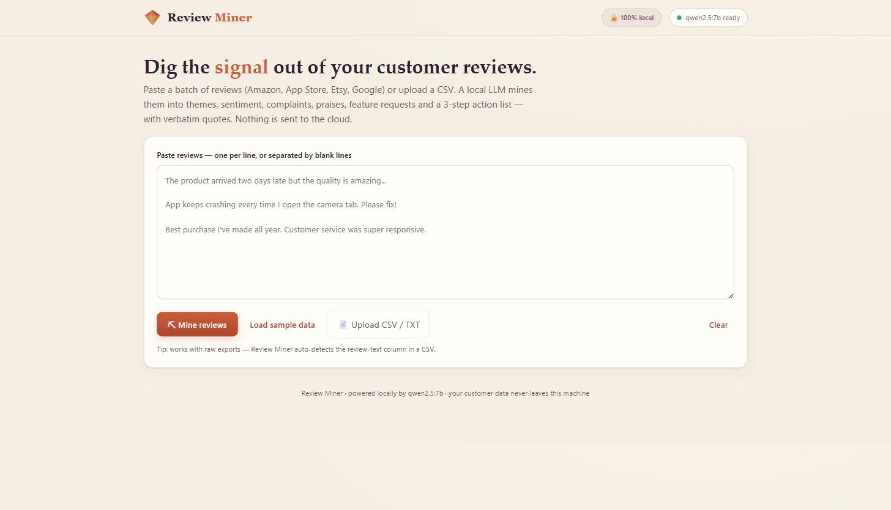
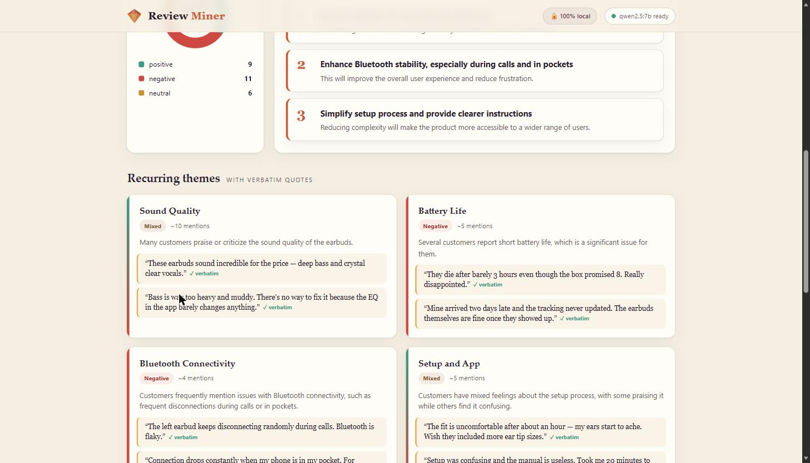
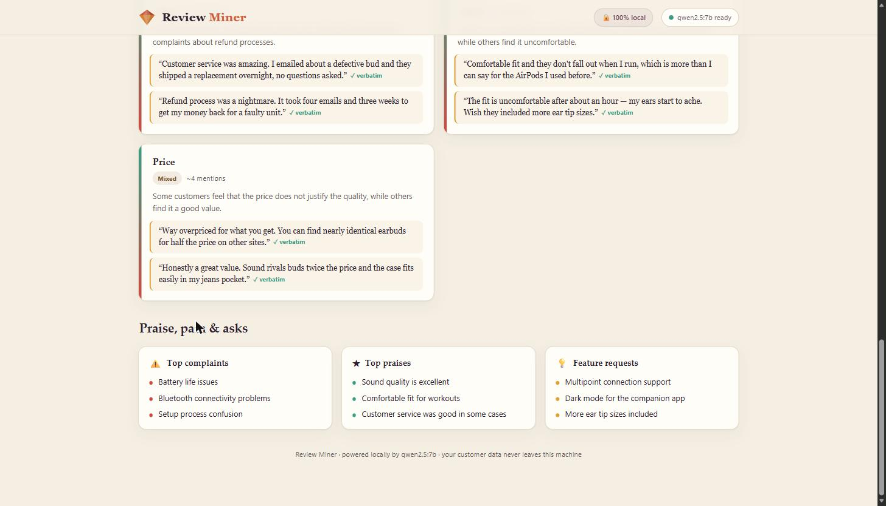

# ⛏ Review Miner

### Mine a batch of customer reviews into the signal that actually matters — themes, sentiment, and a "do these 3 things" action list, all on your own machine.

### [▶️ Get it on Gumroad](#) &nbsp;`[Buy link — coming soon]`

  

---

## What it does

Review Miner takes a messy batch of customer reviews — pasted from Amazon, the App Store, Etsy, or Google, or uploaded as a CSV export — and uses a **local LLM via [Ollama](https://ollama.com)** to turn it into a clean, decision-ready report. Recurring themes (clustered, with sentiment and verbatim example quotes), a positive/negative/neutral sentiment breakdown across the whole batch, your top complaints and top praises, the features customers keep asking for, and a prioritised "do these 3 things" action list of the highest-impact next steps.

## Who it's for

Founders, indie makers, e-commerce sellers, and product managers who have hundreds of reviews and no time to read them — and who don't want to hand their customer data to a $30–50/month SaaS suite that uploads it to someone else's servers. Reviews are *your* data; Review Miner keeps them that way.

## Why local

Review Miner runs entirely on your machine through Ollama — nothing is ever sent to a cloud API. That means unlimited analysis at a flat **$0** cost, complete privacy for your customer data, and the ability to work fully offline.

## Features

- **Recurring theme mining** — themes clustered with sentiment and real example quotes pulled from the source reviews.
- **Sentiment breakdown** — positive / negative / neutral across the entire batch at a glance.
- **Top complaints & top praises** — the pain points and the wins, ranked.
- **Feature requests** — what customers are actually asking you to build next.
- **"Do these 3 things" action list** — the highest-impact next steps, not just a data dump.
- **Quote integrity** — every quote the model returns is checked against the original text and flagged **✓ verbatim** or **paraphrase**, so you can trust what you see.
- **Flexible input** — paste one review per line (or blank-line separated), or upload any CSV; the review-text column is detected automatically.

## Screenshots

*Paste reviews or upload a CSV, then click Mine — Review Miner auto-detects the review column.*

*The report: whole-batch sentiment breakdown and a prioritised do-these-3-things action list.*

*Recurring themes, each clustered with its sentiment and verbatim example quotes.*

*Top praises, top complaints, and the feature requests customers keep raising.*

## How it works

A Python + FastAPI backend talks to Ollama's local HTTP API. Reviews are parsed and de-noised (with automatic CSV column detection), then run through two passes: a batched sentiment classification, followed by structured theme-and-insight mining that returns JSON. Every quote the model produces is verified against the source text before it reaches the dashboard, which is a single self-contained page — no build step and no external JS dependencies.

## Tech stack

`Python 3.12` · `FastAPI` · local `Ollama` (`qwen2.5:7b`) · vanilla HTML/CSS/JS dashboard (no framework, no build step)

---

## ▶️ Get Review Miner

`[Buy link — coming soon]` — a Gumroad listing for this tool isn't live yet.

*This is a showcase repository — it contains the product overview and screenshots only. The full source is available with your purchase.*

 

**Built by Hugo Kuznicki**

[🌐 Website](https://kuznickicapital-ship-it.github.io/personal-site/) · [📰 Newsletter](https://hugos-newsletter-e0c067.beehiiv.com/) · [𝕏 @Kuznickihugo](https://x.com/Kuznickihugo)

If my tools save you time, you can [💜 sponsor my work on GitHub](https://github.com/sponsors/kuznickicapital-ship-it).

